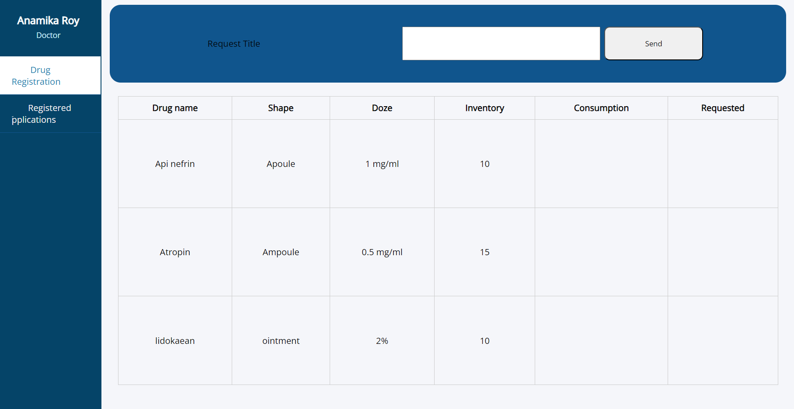

#  Drug Request Registration System

* Analysis and design of database system and drawing DFD and ERD diagrams with Edraw Max. 

* Used Xampp and phpmyadmin for database 

* Determination WBS, Budget and resource of Project by MS-Project. 

* Used React library with Typescript, node.js, and PHPmyadmin for the developed system. 

